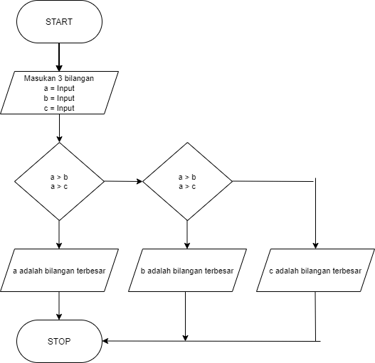
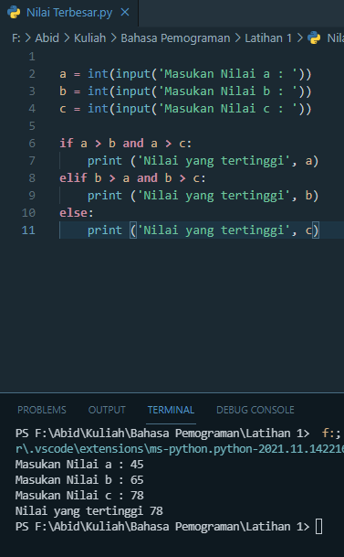

# labspy02
## Program Menentukan Bilangan Terbesar dengan Tiga buah Bilangan

- Algoritma
1. buat 3 variabel seperti a, b, c
2. membuat input untuk 3 variabel tersebut
3. kemudian buat jika a > b dan a > c maka lebih besar a
4. b > a dan b > c maka lebih besar b
5. jika di program diatasm salah lebih besar c

- flowchart 

- Kodingan atau kondisi 

- selesai